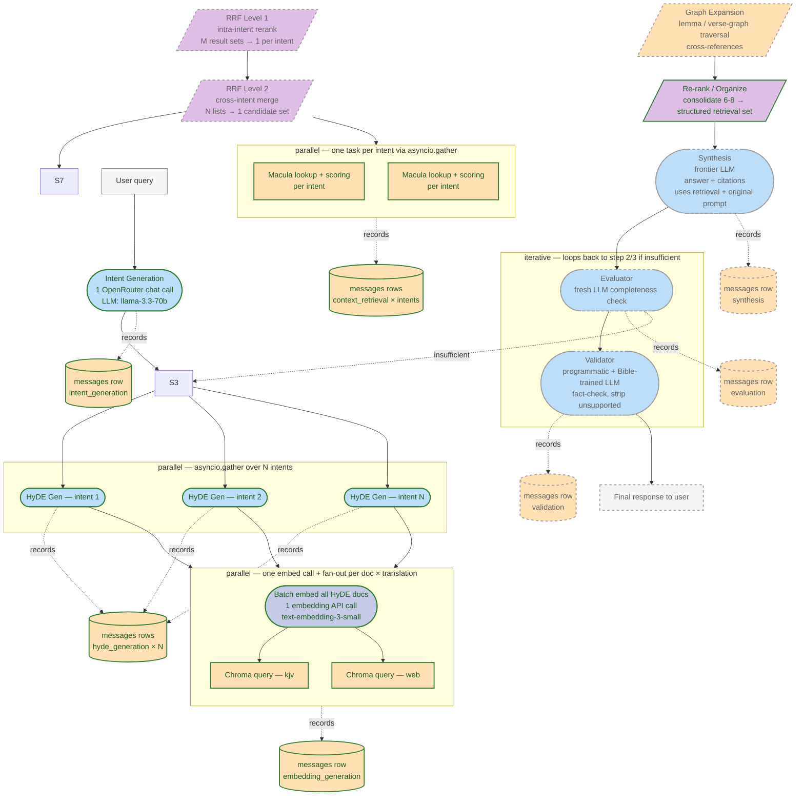

# StrongChat Architecture Diagrams

> Open these Mermaid blocks in any GitHub/GitLab README, VS Code Mermaid
> preview, or [mermaid.live](https://mermaid.live) to render.

## Legend conventions (shared by both diagrams)

Each node encodes three axes at once:

| Axis                   | Encoding                                                                              |
|------------------------|---------------------------------------------------------------------------------------|
| **Call type**          | node shape + fill color (see below)                                                   |
| **Status**             | green solid border = ✅ implemented, grey dashed border = 📋 planned                  |
| **Parallel vs serial** | subgraph labeled `parallel` / `iterative`, or edges fanning out from one node to many |
| **LLM / API vs local** | blue = remote LLM/API, tan = local DB / data, purple = pure compute, grey = data handoff |

### Class names (used in the diagrams)

| Class              | Shape        | Meaning                                           |
|--------------------|--------------|---------------------------------------------------|
| `impl_llm`         | stadium blue | ✅ OpenRouter chat-completion LLM call             |
| `impl_embed`       | stadium indigo | ✅ OpenRouter `/v1/embeddings` API call          |
| `impl_db`          | cylinder tan | ✅ local SQLite / ChromaDB lookup                  |
| `impl_compute`     | parallelogram purple | ✅ pure local compute / score               |
| `impl_data`        | rectangle grey | ✅ data handoff / pipeline result                |
| `planned_llm`      | stadium blue, dashed | 📋 planned LLM call                          |
| `planned_db`       | cylinder tan, dashed | 📋 planned DB / data step                    |
| `planned_compute`  | parallelogram purple, dashed | 📋 planned pure compute                  |
| `planned_data`     | rectangle grey, dashed | 📋 planned data step                       |
| `data`             | rectangle grey | neutral data handoff (no status)                  |

---

## 1. Top-level 13-step pipeline

**Notes on the top-level diagram**

- Steps 2–9 form the **retrieval half** (English for semantic search, original language for grounding).
- Step 2 → 3 is **serial** (HyDE needs the parsed intents).
- Step 3 fans out **N parallel LLM calls** (1 ≤ N ≤ 5).
- Step 4 does **1 batched embedding API call**, then **parallel Chroma queries** over `(doc × translation)`.
- Step 7 runs **one task per intent in parallel**, each doing the full Macula + scoring flow shown in detail below.
- Steps 10–13 are **serial**, with step 11 forming a **conditional loop** back to HyDE generation.

---

## 2. Retrieval + context detail (steps 4–9 zoom-in)

```mermaid
flowchart TD
    classDef impl_llm fill:#bbdefb,stroke:#2e7d32,stroke-width:2px,color:#1b5e20
    classDef impl_embed fill:#c5cae9,stroke:#2e7d32,stroke-width:2px,color:#1b5e20
    classDef impl_db fill:#ffe0b2,stroke:#2e7d32,stroke-width:2px,color:#1b5e20
    classDef impl_compute fill:#e1bee7,stroke:#2e7d32,stroke-width:2px,color:#1b5e20
    classDef impl_data fill:#f5f5f5,stroke:#2e7d32,stroke-width:2px,color:#1b5e20
    classDef planned_db fill:#ffe0b2,stroke:#9e9e9e,stroke-width:2px,stroke-dasharray:5 5,color:#616161
    classDef planned_compute fill:#e1bee7,stroke:#9e9e9e,stroke-width:2px,stroke-dasharray:5 5,color:#616161
    classDef data fill:#f5f5f5,stroke:#757575

    IN["HyDE docs<br/>from step 3"]:::data --> E

    E(["Batch embed all valid HyDE docs<br/>1 API call<br/>chunk_size=256, retry/backoff"]):::impl_embed
    E -. records .-> ME[("messages row<br/>embedding_generation")]:::impl_db

    subgraph PAR_QUERY ["parallel — asyncio.to_thread + gather over doc × translation"]
        direction TB
        Q1[("ChromaDB<br/>kjv_verses<br/>cosine HNSW")]:::impl_db
        Q2[("ChromaDB<br/>web_verses<br/>cosine HNSW")]:::impl_db
    end
    E --> Q1
    E --> Q2
    Q1 --> HITS1[/"top-K hits per doc"/]:::impl_compute
    Q2 --> HITS2[/"top-K hits per doc"/]:::impl_compute

    HITS1 & HITS2 --> RRF1[/"RRF L1 — merge M lists per intent<br/>score normalization + fusion"/]:::planned_compute
    RRF1 --> RRF2[/"RRF L2 — merge N intent lists<br/>into one candidate set"/]:::planned_compute

    RRF2 --> PAR_CTX

    subgraph PAR_CTX ["parallel per intent — asyncio.gather"]
        direction TB
        subgraph PER_HIT ["per candidate verse — serial within intent"]
            direction TB
            REF[/"Parse verse reference<br/>book / chapter / verse"/]:::impl_compute
            MAC[("SQLite<br/>macula_tokens<br/>Greek (book_num>=40) + Hebrew (book_num<40) — lemma + Strong's + morph + gloss")]:::impl_db
            POSF[/"POS filter + language routing<br/>Greek: POS_WEIGHTS (Robinson) · Hebrew: POS_WEIGHTS_HEBREW (HAM)"/]:::impl_compute
            FREQ[("SQLite<br/>strongs_frequency<br/>corpus count per Strong's #<br/>filtered by testament NT/OT")]:::impl_db
            SENSE[("SQLite<br/>lexicon_definitions<br/>Greek: tbESG + lsj · Hebrew: tbESH<br/>filtered by lexicon_source")]:::impl_db
            SCORE[/"composite_score =<br/>pos_weight × log1p(1/freq) × log1p(senses)"/]:::impl_compute
            TRIM[/"trim top 20%<br/>min 2 kept per verse"/]:::impl_compute
            BUNDLE["attach context_bundle<br/>scored_words + kept_words<br/>lexicon_source tag: 'tbESG+LSJ' | 'tbESH'"]:::impl_data

            REF --> MAC --> POSF --> FREQ --> SENSE --> SCORE --> TRIM --> BUNDLE
        end
    end
    PAR_CTX -. records .-> MC[("messages rows<br/>context_retrieval × intent")]:::impl_db

    BUNDLE --> EXPAND[("Graph Expansion<br/>lemma / verse-graph cross-refs<br/>not yet implemented for either testament")]:::planned_db
    EXPAND --> ORG[/"Re-rank / Organize<br/>consolidate 6-8 into retrieval set"/]:::impl_compute
    ORG --> OUT["Structured retrieval set<br/>ready for synthesis step 10"]:::data
```

**Notes on the detail diagram**

- The single shared `EmbeddingService.embed_texts` call batches all valid HyDE docs in **one** API request; the fan-out to ChromaDB collections happens after.
- Inside `PAR_CTX`, each intent runs **in parallel** with the others; within an intent, the **per-hit** sub-pipeline is **serial** (synchronous lookups / scoring on each verse).
- All lookups after the embedding API call are **local** (SQLite + ChromaDB); the only remote call in this half is the embedding request at the top.
- The scoring formula and `top-20%` trim rule live in `src/config/context_constants.py` and `src/services/context/service.py`.
- `Graph Expansion` (step 8) is the only step in this half that is still **planned**; the rest of the retrieval detail is implemented.